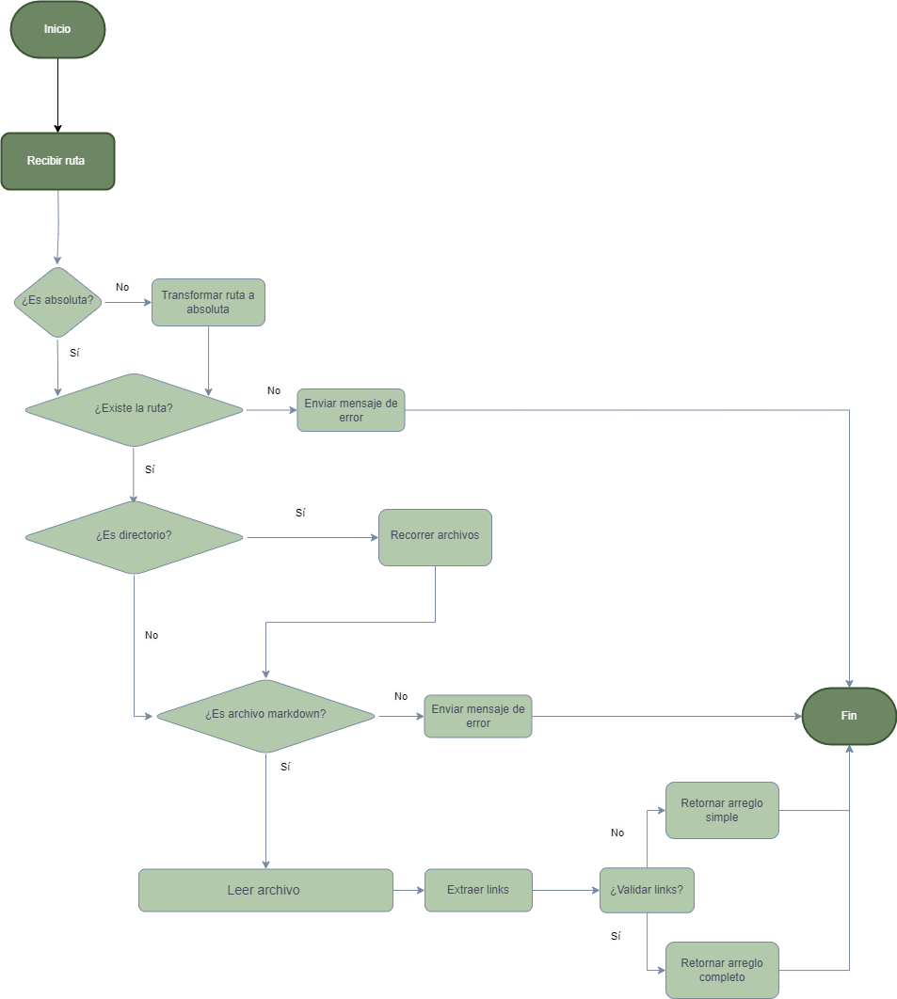

# 📚 mdLinks: Análisis de Enlaces en Markdown

## Descripción del proyecto


mdLinks es una librería en Node.js que facilita la verificación, lectura y análisis de enlaces en archivos Markdown. 👩‍💻 Es ideal para garantizar la calidad de la documentación en tus proyectos.

✅ Con mdLinks, puedes:

Detectar enlaces rotos o válidos.
Asegurarte de que los enlaces estén en buen estado.
Evitar problemas para los usuarios al identificar enlaces a páginas inexistentes.

## 1. Desarrollo del proyecto

El primer paso para lograr el funcionamiento, se logró a través de un diagrama de flujo. 



## 2. Instalación

Ejecutar el siguiente comando en la terminal:

```shell
npm install ginapedraza/DEV010-md-links
```

## 3. Funcionamiento

Al ejecutar el siguiente comando: 

```shell
md-links ./examples
```

La librería la procesará la información y devolverá, una ruta absoluta, la confirmación o negación de que el archivo existe en la computadora y un arreglo de archivos markdown encontrados. 

Así mismo mostrará las siguientes propiedades:

```shell
file: Ruta del archivo donde se encontró el link.
href: URL encontrada.
text: Texto que aparecía dentro del link (<a>).
```

### Opciones disponibles

#### --validate

Si pasamos la opción --validate, el módulo debe hacer una petición HTTP para averiguar si el link funciona o no. Si el link resulta en una redirección a una URL que responde ok, entonces consideraremos el link como ok.

Comando: 
```shell
md-links ./examples --validate
```

Recibiremos:

```shell
./examples https://www.npmjs.com/ Ok 200 NPM
./examples https://github.com/Laboratoria/bootcamp/assets/123121338/910720c6-aa3f-4d08-b076-c1add13c95f1 Ok 200 mdlinks-example-stats
./examples https://github.com/Laboratoria/bootcamp/assets/123121338/9d9971a0-866a-4c64-a890-4c62c3df3700 Ok 200 mdlinks-example-stats-validate
./examples https://es.wikipedia.org/wiki/Markdown Ok 200 Markdown
```

#### --stats

Si pasamos la opción --stats el output (salida) será un texto con estadísticas básicas sobre los links.

Comando: 
```shell
md-links ./examples --stats
```

Recibiremos:

```shell
🔗Cantidad de links: 4
🔗Enlaces únicos: 4
```

#### --validate --stats

También podemos combinar --validate y --stats para obtener estadísticas que necesiten de los resultados de la validación.

Comando: 
```shell
md-links ./examples --validate --stats
```

🔗 Cantidad de links: 4
🔗 Enlaces únicos: 4 
🔗 Enlaces válidos: 4
🔗 Enlaces rotos: 0 
